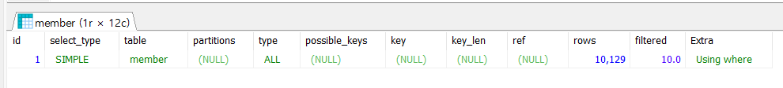
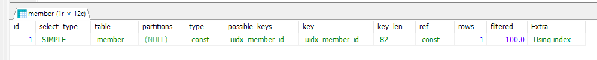

# 회원 아이디 인덱스 추가

회원 가입을 할 때 회원 아이디가 이미 등록되어 있는지 확인해야 합니다. 인덱스를 적용하면 빠른 검색에 도움이 됩니다. 

<br>

### 주의점

* 인덱스를 설정하면 데이터 입력, 수정, 삭제할 때 시간이 오래 걸린다. 
* 더미 데이터나 일괄 수정 작업을 할 땐 잠시 인덱스를 삭제하고 작업 후 인덱스를 설정하는 것이 좋다. 

<br>

## 순서

조회 SQL > SQL 성능 측정 > 인덱스 추가 > SQL 성능 측정 

member 테이블에는 10,000개의 데이터가 담겨있다. 

<br>

### 조회  SQL 

```sql
explain SELECT 
	COUNT(*) > 0
FROM
	member
WHERE
	member_id = 'id05003'
```

select sql에 explain 키워드로 실행 계획을 살펴봅니다. 

<br>

### SQL 실행 계획 



* type : ALL  
  * ALL은 전체 테이블 스캔을 의미한다. type은 조인 혹은 조회 유형을 나타낸다.
* rows : 10,129
  * 데이터베이스가 쿼리를 수행하기 위해 읽어야 할 추정 행 수이다.
* filtered : 10.0 (10%만 통과될 것)
  * 전체 검색된 행 중에 실제로 결과에 반환되는 행의 비율을 백분율로 표현한 것 이다. 전체 검색된 행 중 10%만이 최종 쿼리 결과로 사용될 것이라 보고 있다.
  * filtered의 비율이 낮으면 where 조건이 많은 행을 걸러내어 결과 집합을 크게 줄인다는 의미이여 튜닝 대상이 되기도 한다.

* Extra : Using where
  * where 절이 사용되어 행을 필터링한다는 의미이다.


실행 계획을 통해 풀 테이블 스캔을 한 다는 것을 확인할 수 있습니다. 즉 한 개의 데이터를 찾기 위해 10,000개의 데이터를 탐색한다는 것 입니다. 이는 매우 비효율적인 방법으로 index를 적용하여 성능을 높일 수 있습니다. 


<br>

### 인덱스 추가

특정 ID 값을 검색하는 쿼리에서 인덱스 추가는 효과적인 쿼리 튜닝 방법입니다. 

인덱스를 추가하면 풀 테이블 스캔이 아니라 원하는 ID로 접근하므로 훨씬 적은 수의 행을 검사한다. 

member_id는 중복을 허용하지 않으므로 unique index를 추가했습니다. 

<br>

인덱스 추가 쿼리 

```
# 추가 양식
CREATE INDEX [인덱스 이름] ON [테이블 이름]; 

# 중복 허용 에시
CREATE INDEX idx_member_id ON member(member_id); 

# 중복 허용 안함 예시
CREATE UNIQUE INDEX uidx_member_id ON member(member_id); 
```

<br>

인덱스 확인

```
# 확인 양식
SHOW INDEXES FROM [테이블 이름]; 

# 예시
SHOW INDEXES FROM member; 
```

<br>

인덱스 확인 결과


<br>

### 인덱스 적용 후  SQL 실행 계획




* type : const 
  * const는 주로 primary key 혹은 unique index와 결합딘 쿼리에서 단일 행을 매우 빠르게 반환할 수 있음을 나타냅니다. 쿼리는 인덱스를 통해 단 하나의 행만 정확하게 식별할 수 있습니다. 
* possible_keys : uidx_member_id
  * 쿼리에 사용 가능한 인덱스가 표시됩니다. 
* key : uidx_member_id
  * 실제로 쿼리에서 사용된 인덱스를 나타냅니
* ref : const
  * 인덱스를 통해 조회된 값은 상수(const)값 입니다. 이는 쿼리 조건에 상수 값이 사용되어 해당 값과 일치하는 행을 찾았다는 의미입니다. 
* rows : 1 
  * DB가 처리해야 할 행의 수를 추정하는 값 입니다. 1인 이유는 unique index를 사용하여 정확히 한 행만 찾아내기 때문입니다. 
* filtered : 100 
  * 쿼리를 통해 반환된 데이터의 비율이며, 여기서는 100% 입니다. 즉 추정된 행(1행) 모두 결과로 반환되었다는 의미입니다. 
* Extra : Using index 
  * 이 쿼리가 index-only scan 을 수행했다는 것을 나타냅니다. 쿼리의 결과를 반환하기 위해 테이블의 데이터를 읽지 말고 인덱스의 정보만으로 충분하다는 것을 의미합니다. 

<br>

<br>

### 결론

실혱 계획을 통해 type이 all에서 const로 되었고 rows 10129에서 1이 되었습니다. 

즉 불필요한 데이터를 접근하지 않아 성능이 좋아진 것을 확인할 수 있었습니다. 


